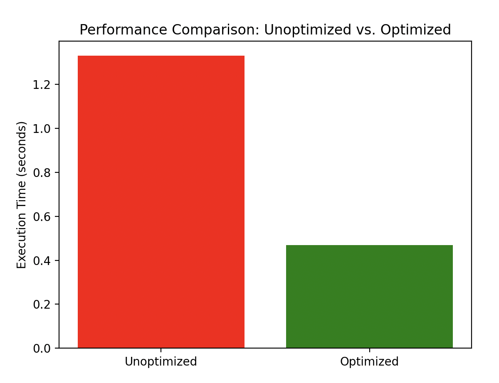

# Performance Optimization in Ad Tech Bidding

This project demonstrates optimization techniques for bidding processes in ad tech, where performance is critical, and milliseconds can make a significant difference. The project includes both an unoptimized and an optimized version of a bidding simulation, with visualizations to compare their performance.

## Features

- **Bidding Simulation:** Simulates a bidding process with network latency, using both unoptimized and optimized approaches.
- **Performance Profiling:** Includes profiling to analyze the execution time of both approaches.
- **Visualizations:** Generates a comparison chart showing the execution time of the unoptimized and optimized bidding processes.

## Requirements

Make sure you have the following Python packages installed:

- `matplotlib`
- `concurrent.futures`

You can install these dependencies using pip:

```bash
pip install matplotlib
```

## Usage

1. **Run the Simulation:**

   To run the bidding simulation and generate the performance comparison, execute the following command:

   ```bash
   python optimize_bidding.py
   ```

2. **View the Results:**

   The script will output the execution times for both the unoptimized and optimized bidding processes and will generate a bar chart comparing their performance.

## Visualizations

The project includes a visualization feature that compares the execution time of the unoptimized and optimized bidding processes. Below is an example of the generated chart:



## How to Contribute

Feel free to submit issues, fork the repository, and send pull requests! Contributions are welcome.
